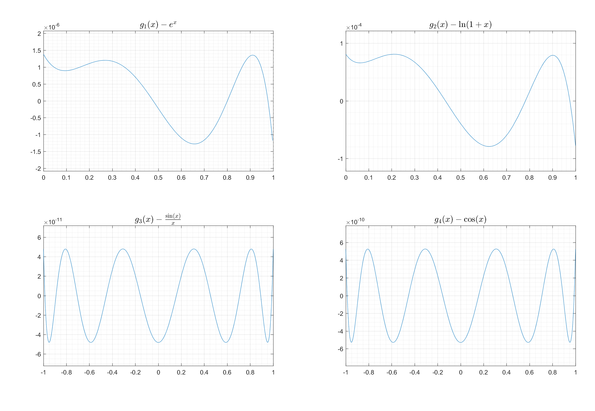
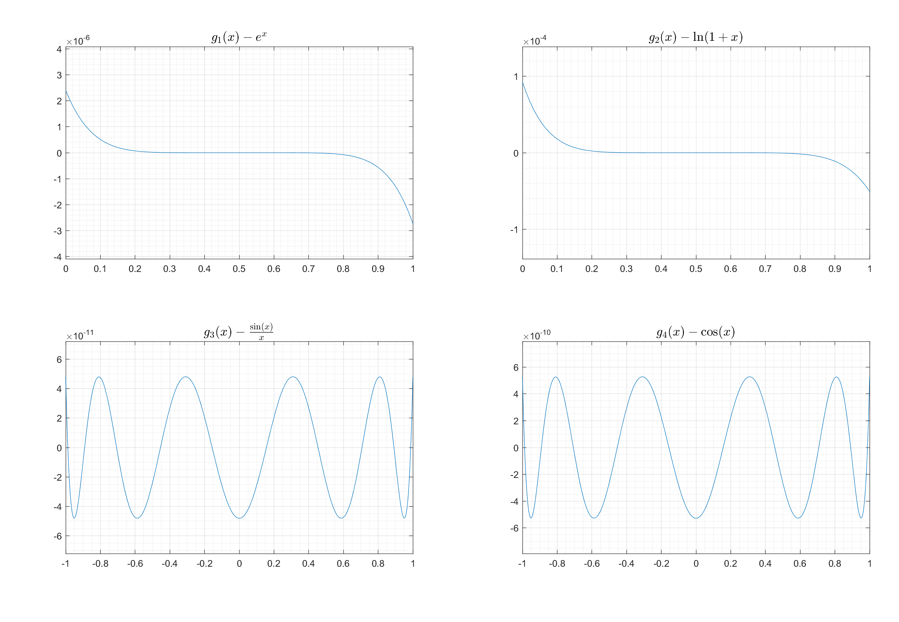
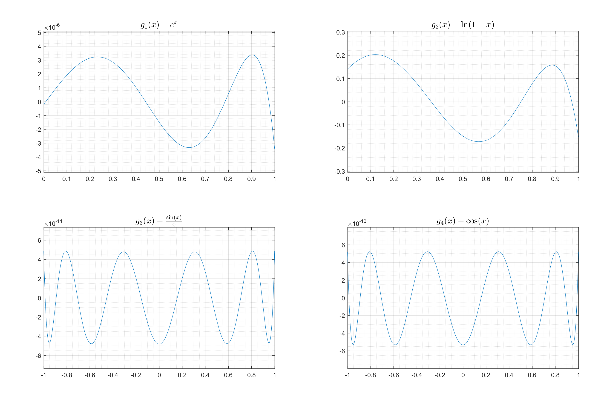

# ChebyshevPolyfit #

Approximation of a function `f(x)` on interval `[a,b]` by a polynomial of degree `N` with the help of Chebyshev polynomials. 

Approximation is done as follows:
- Calculate the Taylor series expansion of `f(x)` around `x=C`.
- Iteratively replace terms of higher order than `N` with their approximation by Chebyshev polynomial.
- Repeat, using higher degree Taylor series. 
- Final approximation is the one that has the lowest _maximum error_.

_Maximum error_ is defined as the maximum absolute difference between the approximation and the original function `f(x)` on the specified interval `[a,b]`. 

Finding optimal `C` is the most interesting part. Taking `C=0` will give the Maclaurin series, which is good for even functions like <code>f3(x)</code> and <code>f4(x)</code>. Taking `C=(a+b)/2` gives much better results for <code>f2(x)</code>.

Hand-picked `C=0.8762` for <code>f1(x)</code> and `C=0.6113` for <code>f2(x)</code> gave the best results in terms of _maximum error_, but after seeing the error function (first image) it is obvious that using `C=(a+b)/2=0.5` (second image) gives results which are more consistent. Since the small improvement did not increase the number of correct decimal digits, generally speaking, taking `C=0.5` might be a better solution.

Below are approximations for hand-picked values of `C`.
  

## Approximation results ##

### <code>f1(x) = ex</code> ###
Coefficients for `exp(x)` on the interval `[0, 1]` with `C=0.8762`:

|       Coefficient      |            Term            |
|------------------------|:--------------------------:|
| `+0.0.001812583342355` | <code>x6</code> |
| `+0.00802002064194580` | <code>x5</code> |
| `+0.04196707939319135` | <code>x4</code> |
| `+0.16639182169042781` | <code>x3</code> |
| `+0.50009994005663482` | <code>x2</code> |
| `+0.99998761032346109` | `x`                        |
| `+1.00000138583625075` | `1`                        |

Maximum error on that interval: `1.387174778327080e-06`
  

### <code>f2(x) = ln(1+x)</code> ###
Coefficients for `ln(1+x)` on the interval `[0, 1]` with `C=0.6113`:

|       Coefficient      |            Term            |
|------------------------|:--------------------------:|
| `-0.03120137898937330` | <code>x6</code> |
| `+0.10196463478682490` | <code>x5</code> |
| `-0.18725593916599687` | <code>x4</code> |
| `+0.30301542826567001` | <code>x3</code> |
| `-0.49295760517944778` | <code>x2</code> |
| `+0.99942287921168635` | `x`                        |
| `+0.00008118594007705` | `1`                        |

Maximum error on that interval: `8.121660103074230e-05`
  

### <code>f3(x) = sin(x)/x</code> ###
Coefficients for `sin(x)/x` on the interval `[-1, 1]` with `C=0`:

|       Coefficient      |            Term            |
|------------------------|:--------------------------:|
| `+0.00000269375975766` | <code>x8</code> |
| `-0.00019835866408658` | <code>x6</code> |
| `+0.00833331406945632` | <code>x4</code> |
| `-0.16666666426123592` | <code>x2</code> |
| `+0.99999999995192540` | `1`                        |

Maximum error on that interval: `4.805667042378870e-11`
  

### <code>f4(x) = cos(x)</code> ###
Coefficients for `cos(x)` on the interval `[-1, 1]` with `C=0`:

|       Coefficient      |            Term            |
|------------------------|:--------------------------:|
| `+0.00002412120108317` | <code>x8</code> |
| `-0.00138829603431855` | <code>x6</code> |
| `+0.04166645537534186` | <code>x4</code> |
| `-0.49999997362171781` | <code>x2</code> |
| `+0.99999999947287566` | `1`                        |

Maximum error on that interval: `5.271243440664400e-10`
  

## Errors in approximations ##

#### Approximations from tables above: ####

#### Approximations using Taylor series expansion around the central point, `C=(a+b)/2`: ####

#### Approximations using integrals, similar to `C=0`: ####

## Related Projects 
- [Chebyshev](https://github.com/mlazaric/Chebyshev) by [@mlazaric](https://github.com/mlazaric).
