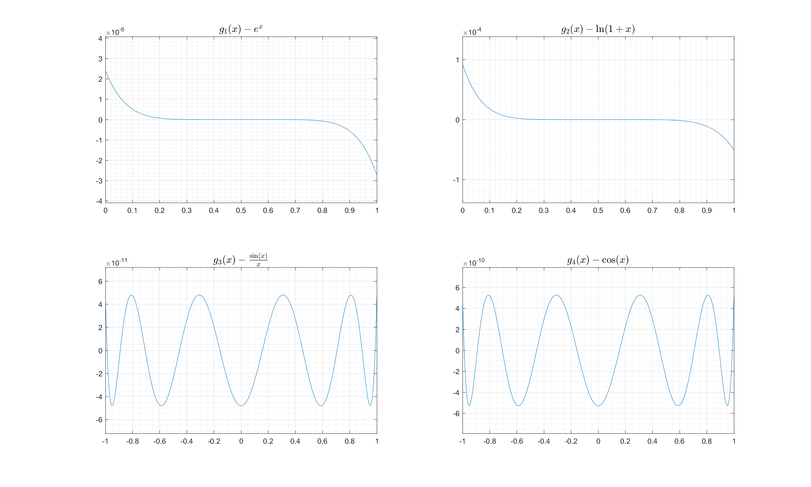
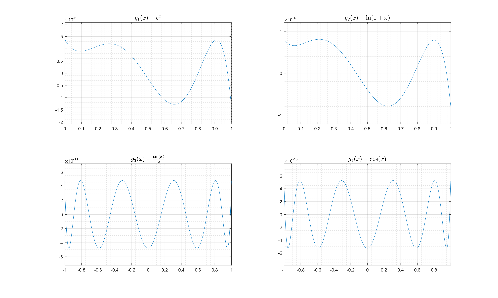

# ChebyshevPolyfit #

Approximate functions by polynomials:
- <pre>exp(x),    0<=x<=1, deg=6</pre>
- <pre>log(1+x),  0<=x<=1, deg=6</pre>
- <pre>sin(x)/x, -1<=x<=1, deg=8</pre>
- <pre>cos(x),   -1<=x<=1, deg=8</pre>

## `exp(x)` ##
```
0.00181258334235528 * x^6 + 
0.0080200206419458  * x^5 + 
0.0419670793931914  * x^4 + 
0.166391821690428   * x^3 + 
0.500099940056635   * x^2 + 
0.999987610323461   * x + 
1.00000138583625
```

## `log(1+x)` ##
```
- 0.0312013789893733    * x^6 + 
  0.101964634786825     * x^5 +
- 0.187255939165997     * x^4 + 
  0.30301542826567      * x^3 +
- 0.492957605179448     * x^2 + 
  0.999422879211686     * x + 
  0.0000811859400770467
```

## `sin(x)/x` ##
```
  0.00000269375975765659 * x^8 +
- 0.000198358664086584   * x^6 + 
  0.00833331406945632    * x^4 +
- 0.166666664261236      * x^2 +
  0.999999999951925
```

## `cos(x)` ##
```
  0.0000241212010831705 * x^8 +
- 0.00138829603431855   * x^6 +
  0.0416664553753419    * x^4 +
- 0.499999973621718     * x^2 +
  0.999999999472876
```




